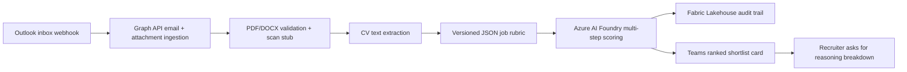

# HireSignal

HireSignal is a Teams-native Microsoft 365 Copilot enterprise agent for recruiters who are overwhelmed when a hiring post fills up fast. The demo story is grounded in a real hiring pain point: a post hit its applicant cap in 14 minutes, leaving recruiters with too much signal to triage manually and too little time to explain why each candidate did or did not make the shortlist.

The agent monitors a recruiter Outlook inbox, validates CV attachments, scores each candidate against a versioned job rubric with Azure AI Foundry, writes repeatable audit records to Microsoft Fabric, and posts a clean ranked shortlist card into Microsoft Teams.

## Hackathon Focus

- Accuracy and relevance: structured rubric-driven CV scoring.
- Reasoning and multi-step thinking: separate skills, experience, role-fit, and overall scoring stages.
- Creativity and originality: real-world applicant-cap validation anchors the demo.
- User experience: a Teams shortlist card that can be explained in under two minutes.
- Reliability and safety: no hardcoded secrets, PII hashing, explicit fallbacks, and typed model contracts.
- Community vote: problem first, tech second.

## Architecture



## Current Scaffold

- FastAPI backend in `app/`.
- Microsoft Graph app-only authentication stub using MSAL.
- Microsoft Graph webhook endpoint for Outlook change notifications.
- Message attachment retrieval through Graph with retry handling for 429 and transient 5xx responses.
- PDF text extraction with PyMuPDF and DOCX text extraction using the DOCX package XML.
- Versioned sample rubric in `config/job_rubric.sample.json`.
- Validated rubric contract for skills match, experience relevance, and role fit scoring.
- Multi-step candidate scoring for skills match, experience relevance, role fit, and weighted overall score.
- Azure AI Foundry scoring adapter with schema-bound responses and deterministic local fallback.
- Pydantic contracts for Graph tokens, notifications, attachments, documents, rubrics, and scoring.
- Attachment validation, scan stub, manual-review fallback queue, and candidate hashing utilities.
- Docker, Docker Compose, GitHub Actions CI, Ruff, Mypy, and Pytest.
- GitHub Copilot project instructions in `.github/copilot-instructions.md`.

## Setup

```bash
cp .env.example .env
python -m venv .venv
source .venv/bin/activate
pip install ".[dev]"
pytest
uvicorn app.main:app --reload
```

`GRAPH_TENANT_ID`, `GRAPH_CLIENT_ID`, and `GRAPH_CLIENT_SECRET` must come from an Azure app registration or Azure Key Vault-backed runtime. Local `.env` is for developer machines only and is ignored by git.

## Graph Authentication Stub

Run the API and call:

```bash
curl http://localhost:8000/graph/auth/status
```

The route attempts to acquire a Microsoft Graph app token using the client credentials flow and returns only token metadata, never the access token itself.

## Outlook Webhook Ingestion

Microsoft Graph validates webhook endpoints by sending a `validationToken` query parameter. HireSignal responds with that token as `text/plain` before loading any runtime credentials:

```bash
curl -X POST "http://localhost:8000/graph/notifications?validationToken=opaque-token"
```

Normal notification delivery posts a change notification collection to the same endpoint. HireSignal validates `clientState`, extracts the message ID, fetches message attachments from Graph, accepts only PDF/DOCX file attachments, runs the scan stub, and queues any failure for manual review.

Accepted CVs are parsed in memory only. Raw CV text is not logged or persisted by this stage; only extraction success counts and the validated rubric version move forward to scoring.

## Scoring

HireSignal scores each extracted CV in separate stages:

1. Skills match.
2. Experience relevance.
3. Role fit.
4. Weighted overall score.

Each stage returns a Pydantic-validated structured result with score, reasoning, matched signals, and missing signals. The Azure AI Foundry adapter sends a JSON-schema response contract to the configured endpoint. When Foundry is not configured for local development, deterministic fallback scoring keeps the demo and CI reliable without storing raw CV text.

Configure Foundry with:

```bash
AZURE_AI_FOUNDRY_ENDPOINT=
AZURE_AI_FOUNDRY_API_KEY=
AZURE_AI_FOUNDRY_MODEL=gpt-4.1-mini
USE_LOCAL_SCORING_FALLBACK=true
```

`AZURE_AI_FOUNDRY_ENDPOINT` should be the chat-completions compatible endpoint for the chosen Azure AI Foundry deployment. It is intentionally environment-driven so no endpoint, key, or deployment name is hardcoded.

Verified Microsoft Docs:

- [Receive change notifications through webhooks](https://learn.microsoft.com/en-us/graph/change-notifications-delivery-webhooks)
- [List message attachments](https://learn.microsoft.com/en-us/graph/api/message-list-attachments?view=graph-rest-1.0)
- [Get attachment](https://learn.microsoft.com/en-us/graph/api/attachment-get?view=graph-rest-1.0)

## Demo Video

Demo video link: pending.

## Next Stage

After confirmation, the next build step is Microsoft Fabric audit persistence:

1. Define the audit record schema for candidate hash, score, reasoning, job ID, rubric version, and timestamps.
2. Add a local SQLite audit repository for development.
3. Add a Fabric Lakehouse adapter boundary for production persistence.
4. Ensure no raw CV text or PII is written to logs or tables.

## Quick Demo
 - Copy `.env.example` to `.env` and set required values.
 - Run the API locally:

```bash
./scripts/demo.sh
```

## Fabric Lakehouse Adapter (scaffold)

This repo includes a scaffolded Fabric Lakehouse adapter at `app/services/fabric_lakehouse.py` for teams that want to implement direct Lakehouse writes. The current `FabricAuditRepository` posts audit records to a configured Fabric endpoint; the Lakehouse adapter is intentionally a boundary placeholder for production implementations that need batching, authentication, and idempotency.

## Teams shortlist posting

HireSignal can post a plaintext shortlist to Microsoft Teams when `TEAMS_CHANNEL_ID` is set. Provide `TEAMS_CHANNEL_ID` in the form `teamId/channelId` and the service will post a simple ranked list after successful scoring and audit persistence. The endpoint to request a reasoning breakdown is available at `/teams/explain` and accepts `jobId` and `candidateHash` query parameters.
