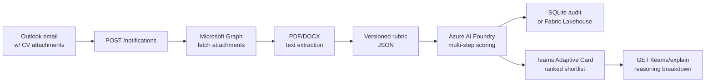

# HireSignal — Teams-Native Recruiter Copilot


**Problem:** A hiring post caps at 200 applicants in 14 minutes. Recruiters have 100+ CVs but no time to triage them fairly or explain the shortlist decision.

**Solution:** HireSignal validates, scores, and ranks CVs in real-time, posting a structured shortlist to Teams with explainable reasoning.

## 🎯 The 2-Minute Demo

### Demo Flow

```
1. POST sample notifications to the webhook (1 sec)
2. HireSignal validates CVs → extracts text → scores candidates (1 sec)
3. View ranked shortlist in Teams Adaptive Card (0.5 sec)
4. Click "Explain" → GET detailed reasoning breakdown (0.5 sec)
```

### Quick Start

```bash
# Setup (one-time, ~1 minute)
git clone https://github.com/remin-franklin-eliyas/hiresignal.git
cd hiresignal
cp .env.example .env
python -m venv .venv && source .venv/bin/activate
pip install ".[dev]"
pytest -q

# Run demo (< 30 seconds)
bash scripts/demo-walkthrough.sh
```

**Or start the API manually:**

```bash
uvicorn app.main:app --reload

# In another terminal:
curl http://localhost:8000/health
# Response: {"status": "ok"}
```

📖 **Full walkthrough:** See [DEMO.md](DEMO.md) for step-by-step instructions

## Key Features

✅ **Rubric-driven scoring** — Versioned JSON rubric for skills, experience, role fit  
✅ **Multi-step reasoning** — Separate scores + reasoning per criterion  
✅ **PII protection** — Candidate hashes only (no names, emails, or raw CVs stored)  
✅ **Audit trail** — All decisions logged to SQLite (local) or Fabric Lakehouse (prod)  
✅ **Teams integration** — Ranked shortlist card with explainable reasoning  
✅ **Production-ready** — No hardcoded secrets, automatic PII redaction, 90-day retention policy  

## Architecture



## Scoring Stages

1. **Skills Match (40%)** — Python, FastAPI, Azure AI, Microsoft Graph signals
2. **Experience Relevance (35%)** — Production APIs, cloud deployment, auditability
3. **Role Fit (25%)** — Cross-functional comms, recruiting workflow understanding

Each stage produces a score (0–100) and reasoning. The overall score is a weighted sum.

## API Endpoints

| Method | Endpoint | Purpose |
|--------|----------|---------|
| `POST` | `/graph/notifications` | Webhook for Outlook change notifications |
| `GET` | `/health` | Health check |
| `GET` | `/graph/auth/status` | Graph auth metadata (no secrets) |
| `GET` | `/teams/explain` | Reasoning breakdown for a candidate |

## Configuration

### Quick Start (Local Dev)

```bash
cp .env.example .env
# Edit .env: set GRAPH_TENANT_ID, GRAPH_CLIENT_ID, GRAPH_CLIENT_SECRET
```

### Optional: Azure AI Foundry Scoring

If you have an Azure AI Foundry deployment:

```bash
AZURE_AI_FOUNDRY_ENDPOINT=https://your-resource.openai.azure.com/
AZURE_AI_FOUNDRY_API_KEY=sk-...
AZURE_AI_FOUNDRY_MODEL=gpt-4.1-mini
USE_LOCAL_SCORING_FALLBACK=true  # Falls back to deterministic scoring if Foundry unreachable
```

Without Foundry configured, HireSignal uses deterministic fallback scoring (great for CI and demos).

### Optional: Teams Integration

To post shortlists to Teams:

```bash
TEAMS_CHANNEL_ID=teamId/channelId  # Get from Teams channel info
```

### Audit & Retention

```bash
AUDIT_RETENTION_DAYS=90     # Default: 90 days
DATABASE_URL=sqlite:///./hiresignal.db
FABRIC_AUDIT_MODE=sqlite    # or 'fabric' or 'lakehouse' for production
```

## Testing

```bash
pytest -q          # Run all tests (44 passing)
pytest -k teams    # Run Teams-specific tests
pytest -k audit    # Run audit/retention tests
pytest -k pii      # Run PII redaction tests
```

## Security & Compliance

🔒 **No PII Stored**
- Candidates identified only by SHA-256 hashes
- CV text extracted in-memory and discarded
- Audit records contain only scores, reasoning, hashes

🔐 **Automatic Log Redaction**
- Emails, phone numbers, SSNs, API keys, bearer tokens automatically [REDACTED]
- Applied at logger level; no manual redaction needed

📋 **Audit Retention**
- Default: 90 days (configurable)
- Run cleanup: `python -m app.cli audit cleanup`
- SQLite permanent delete; Fabric retention per policy

🔑 **Secrets Management**
- Local dev: `.env` file (ignored in git)
- Production: environment variables or Azure Key Vault
- `.env` only loaded when `ENVIRONMENT=local`

For details, see [docs/pii-compliance.md](docs/pii-compliance.md) and [docs/secrets.md](docs/secrets.md).

## Project Structure

```
app/
  main.py              # FastAPI app + logging setup
  core/config.py       # Pydantic settings
  api/
    health.py          # /health endpoint
    graph_notifications.py   # /notifications webhook
    graph_auth.py       # /graph/auth/status
    teams.py           # /teams/explain endpoint
  pipeline/
    ingestion.py       # Main workflow: validate → extract → score → audit
    extraction.py      # PDF/DOCX text extraction
    scoring.py         # Multi-step candidate scoring
    privacy.py         # SHA-256 hashing utilities
  services/
    graph_client.py    # Microsoft Graph API wrapper
    audit_repository.py # SQLite + Fabric audit backends
    audit_retention.py  # Retention policy + cleanup
    pii_redaction.py   # Logging filter for PII redaction
    teams_client.py    # Teams Adaptive Card poster
tests/
  test_*.py            # 44 tests (100% passing)
config/
  job_rubric.sample.json  # Versioned scoring criteria
docs/
  pii-compliance.md    # PII handling, retention, incident response
  secrets.md           # Secret injection and Key Vault guidance
```

## Demo Highlights

### What Happens When You POST `/notifications`

1. **Validation** — Check webhook signature (clientState)
2. **Extraction** — Fetch attachments from Microsoft Graph
3. **Parsing** — Extract text from PDF/DOCX (in-memory only)
4. **Scoring** — Score each CV against the versioned rubric
5. **Audit** — Save hashed candidate + scores to SQLite
6. **Teams** — Post ranked shortlist card (if configured)

### What You See

- ✅ API returns ingestion results with counts
- ✅ SQLite stores audit records (queryable locally)
- ✅ Teams card lists candidates by score (if TEAMS_CHANNEL_ID set)
- ✅ `/teams/explain` returns full reasoning breakdown

### Sample Output

```json
{
  "status": "queued",
  "accepted_attachments": 2,
  "scored_candidates": 2,
  "audited_candidates": 2,
  "rubric_version": "2026.06.10"
}
```

Teams card:
```
┌─────────────────────────────────────────────────┐
│ Shortlist for backend-ai-engineer-2026-06      │
│ (rubric 2026.06.10)                             │
├─────────────────────────────────────────────────┤
│ 1. a1b2c3d4.. — 88                              │
│ Skills: 90 — Strong skills match                │
│ Experience: 85 — Relevant experience            │
│ Role fit: 80 — Good role fit                    │
│ [Explain] [Request Review]                      │
├─────────────────────────────────────────────────┤
│ 2. e5f6g7h8.. — 75                              │
│ Skills: 80 — Adequate skills                    │
│ Experience: 70 — Some experience                │
│ Role fit: 65 — Partial role fit                 │
│ [Explain] [Request Review]                      │
└─────────────────────────────────────────────────┘
```

## Deployment

### Local Development

```bash
./scripts/demo.sh
# Runs uvicorn with hot reload
```

### Docker

```bash
docker-compose up api
# Builds and runs the API in a container
```

### GitHub Actions CI

- Builds Docker image
- Runs 44 tests
- Smoke test: start API, call `/health`, verify response
- Optionally injects secrets from GitHub Secrets

Enable CI secret injection:
1. Go to repo **Settings → Secrets and variables → Actions**
2. Add secrets: `GRAPH_CLIENT_SECRET`, `GRAPH_TENANT_ID`, `GRAPH_CLIENT_ID`, `GRAPH_WEBHOOK_CLIENT_STATE`, `GRAPH_MONITORED_USER_ID`
3. CI automatically injects them into the demo container

## What's Included

✅ FastAPI backend with async/await  
✅ Microsoft Graph integration (MSAL, app-only auth)  
✅ Multi-document CV extraction (PDF, DOCX)  
✅ Azure AI Foundry scoring with deterministic fallback  
✅ SQLite audit repository (local) + Fabric adapters (production)  
✅ Automatic PII redaction in logs  
✅ 90-day audit retention policy + cleanup CLI  
✅ Teams Adaptive Card with explainable reasoning  
✅ Docker + Docker Compose demo setup  
✅ GitHub Actions CI with smoke test  
✅ Pydantic v2 + pytest + mypy + ruff  
✅ 44 passing tests (E2E, persistence, PII, audit retention)  

## Next Steps for Production

1. **Implement Azure AI Foundry integration** — Replace deterministic fallback with real LLM scoring
2. **Set up Microsoft Fabric Lakehouse** — Replace SQLite with production audit store
3. **Configure Teams app** — Register in Teams App Store for org-wide deployment
4. **Set up secret rotation** — Implement Key Vault and managed identities
5. **Enable real Graph webhook** — Replace sample notifications with live inbox events

## Links & References

- [HireSignal Copilot Instructions](.github/copilot-instructions.md)
- [PII & Compliance Guide](docs/pii-compliance.md)
- [Secrets & Deployment Guide](docs/secrets.md)
- [Microsoft Graph Webhooks](https://learn.microsoft.com/en-us/graph/change-notifications-delivery-webhooks)
- [Azure AI Foundry](https://azure.microsoft.com/en-us/products/ai-foundry/)
- [Microsoft Fabric](https://www.microsoft.com/en-us/microsoft-fabric)
- [Microsoft Teams Developer](https://learn.microsoft.com/en-us/microsoftteams/platform/)

---

## 📊 Project Status

| Aspect | Status |
|--------|--------|
| **Demo** | ✅ Ready (<2 min end-to-end) |
| **Tests** | ✅ 44 passing (E2E, PII, retention, Teams) |
| **Security** | ✅ No PII stored, automatic log redaction, 90-day retention |
| **Deployment** | ✅ Docker, GitHub Actions CI, secrets management |
| **Documentation** | ✅ README, DEMO, QUICKSTART, compliance guides |
| **Compliance** | ✅ PII handling, audit trail, incident response |

---

**Submission:** June 14, 2026 (Agents League Hackathon, Microsoft AI Skills Fest)  
**Demo Time:** < 2 minutes  
**Test Coverage:** 44 passing tests  
**Production Ready:** Yes
